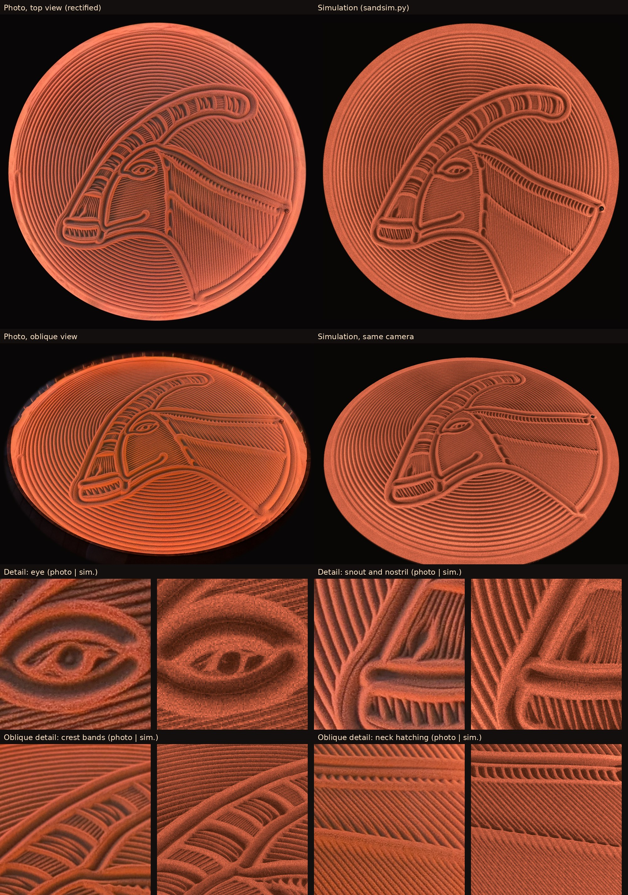
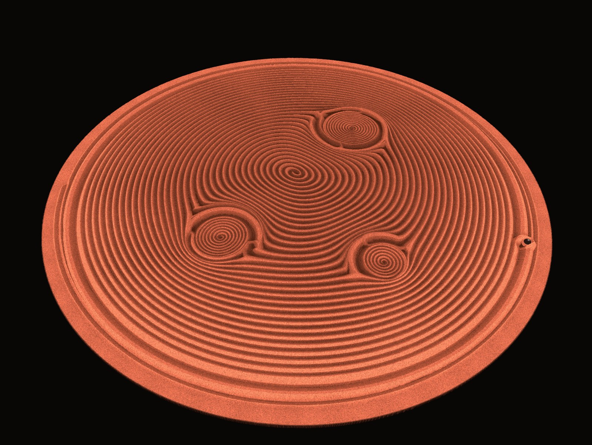
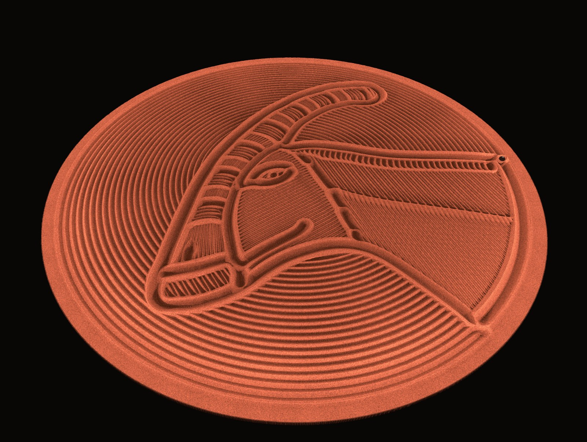

# sandsim – photorealistic previews for sand table patterns

`sandsim.py` simulates how a steel ball draws a theta-rho pattern (`.thr`, as used by
Dune Weaver, Sisyphus and Sandify) into sand, and renders the result with grazing light like
an LED strip around the rim. This lets you iterate on patterns without running the table.



*Left: photos of the Parasaurolophus pattern drawn on a real Dune Weaver Pro (LED light only).
Right: simulation of the same pattern, the oblique view rendered with the camera pose fitted to the photo.*

## Usage

```sh
uv run sandsim.py pattern.thr                 # top view     -> pattern_sand.png
uv run sandsim.py pattern.thr --view oblique  # oblique view -> pattern_sand_oblique.png
```

Dependencies are declared inline (PEP 723), so [uv](https://docs.astral.sh/uv/) installs them
automatically. Options:

| Option | Meaning |
|---|---|
| `-o image.png` | output file |
| `--view top\|oblique` | top view or perspective view with grazing light |
| `--res` | simulation grid in mm/px (default 0.5) |
| `--out-res` | image resolution in mm/px (default 0.25) |
| `--clear auto\|in\|out\|none` | clearing spiral before the pattern (default: auto) |
| `--mirror` | mirror the theta direction |
| `--cam-rot` | rotate the oblique camera around the centre (degrees, counter-clockwise; default 0 = pose of the calibration photo) |

A run takes about 15–20 s (about two thirds simulation, one third lighting).

## Model

1. **Path** – subdivided linearly in theta/rho (this is how the table moves). The ball lags
   about 6 mm behind the magnet and cuts corners; small circles shrink accordingly. A clearing
   spiral (6.1 mm pitch) runs first; its rings stay visible wherever the pattern does not pass.
2. **Sand** – height field at 0.5 mm/px. The 10 mm ball pushes sand, mass-conserving, into a
   narrow bulge in front of and beside itself; then the sand slides according to an
   angle-of-repose model (stable up to 40°, settles at 32°; 8 neighbours, alternating sweep
   direction, so that it is isotropic and line ends stay round). Sharp ridges, fine hatching,
   overwriting and pushed-up ridges at crossings emerge on their own.
3. **Light** – point LEDs along the rim with Lambert shading and cast shadows, ambient light
   with occlusion in grooves, sand grain; one tone curve for both views, matched to photos (top
   and oblique) in orange LED light. The oblique view is ray-cast against the height field; the
   camera (`CAM`: position, target, field of view, roll) is fitted to a photo.

Calibrated against photos of patterns drawn on a Dune Weaver Pro (10 mm ball). The scale was
measured from the photos: rho = 1 corresponds to 290 mm (ball centre), the sand surface has a
radius of 312 mm (diameter about 62 cm). Table geometry, camera and parameters are constants at
the top of `sandsim.py`.

## Examples

| Zen garden (8 mm line pitch) | Parasaurolophus head (oblique view) |
|---|---|
|  |  |

## License

The code is MIT licensed, see [LICENSE](LICENSE).

Third-party content in `examples/`:

- The Parasaurolophus pattern (`parasaurolophus.thr`, its renderings and the photo comparison
  `parasaurolophus_comparison.jpg`) is based on the life
  reconstruction [*Parasaurolophuspic steveoc.jpg*](https://commons.wikimedia.org/wiki/File:Parasaurolophuspic_steveoc.jpg)
  by Steveoc 86, licensed under [CC BY 2.5](https://creativecommons.org/licenses/by/2.5/).
